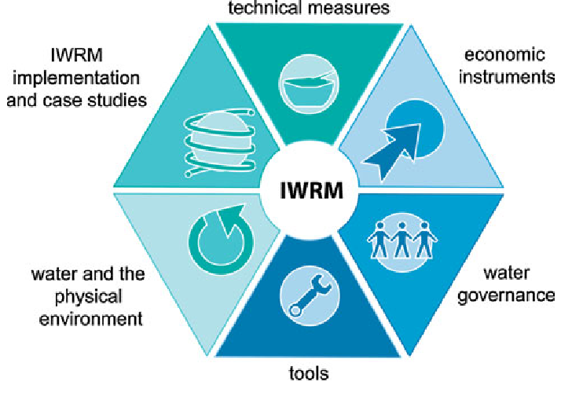

# Hi, I'm Meagan Brown.

My name is [Meagan Brown](meagan_brown@ucsb.edu), I am going into my fourth-year at UCSB as an Environmental Studies student with an emphasis in Geography. I enjoy running, pottery and raising my puppy Zuko. I hope to work with water resource management in the future and use data science as well as tools such as GIS in order to better manage how we use water in the future.

{width="25%"}{width="25%"}

This summer I learned how to work in Rstudio. I learned many things such as the steps needed in order to build a website, data wrangling and visualization skills, how to manipulate geometries and coordinate systems, how to simplify data so that we aren't working with as many geometries and can run code faster. I hope to use the skills I learned in this class in order to better analyze water resources and find ways in order to manage this limited resource. 

{width="50%"}

