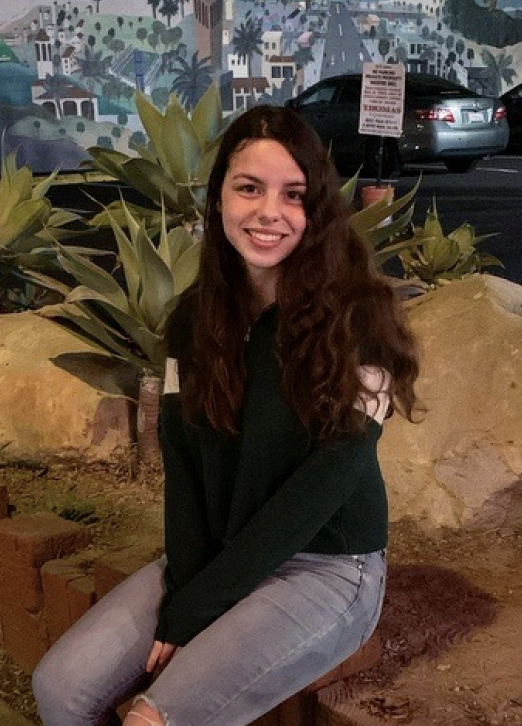
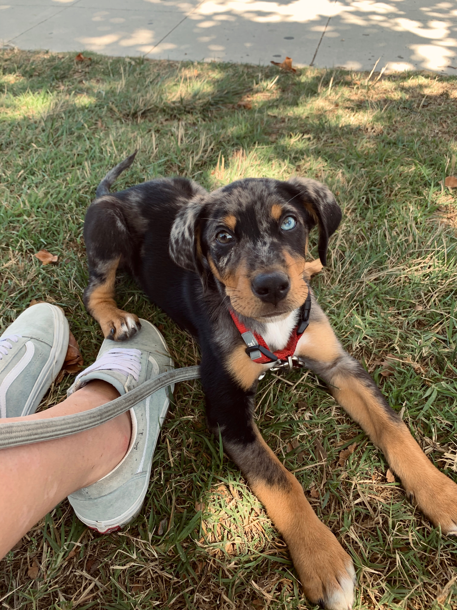

  

# Hi, I'm Meagan Brown.

My name is [Meagan Brown](file:///Users/meaganbrown/Documents/github/meaganbrown.github.io/index.html), I am going into my fourth-year at UCSB as an Environmental Studies student with an emphasis in Geography. I enjoy running, pottery and raising my puppy Zuko. I hope to work with water resource management in the future and use data science as well as tools such as GIS in order to better manage how we use water in the future.

